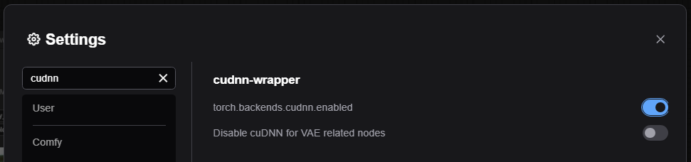
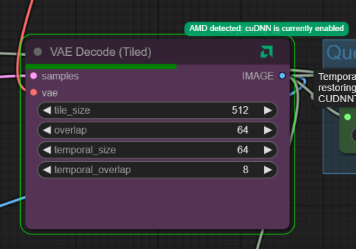

> [!NOTE]
> New: You can now set the default state of `torch.backends.cudnn.enabled` directly in ComfyUI's Settings.  This will be applied at the start of every workflow, to ensure that every job starts with your preferred settings. 
>
> 

# cuDNN Wrapper for AMD VAE Workloads

Dynamically wraps ComfyUI node types so that, when running on AMD-like GPUs, cuDNN is temporarily disabled during
VAE-related encode/decode operations. On NVIDIA GPUs the wrapper goes inert and will not modify cuDNN, so it’s safe to
enable everywhere.

This custom node set focuses on AMD-friendly behavior. By default it lets you add a cuDNN-disabling wrapper to existing
node types (primarily useful for VAE encoding/decoding on AMD). It also includes a manual toggle node you can insert in
workflows when you want full control.

## New: Manual cuDNN Toggle node (AMD-aware)

- Node: "CUDNN Toggle (AMD-aware)"
- Category: ovum/cudnn-wrapper
- Behavior: sets torch.backends.cudnn.enabled to ON/OFF, but only changes anything when an AMD-like
  environment is detected (AMD/ROCm/HIP or ZLUDA). On NVIDIA the node prints a notice and leaves cuDNN unchanged.
- Typical use: place before/after VAE Encode/Decode nodes on AMD to squeeze extra performance.

## Preconfigured VAE coverage

Out of the box, this wrapper is pre‑configured to recognize the common VAE encode/decode node types and will
automatically disable cuDNN around those operations on AMD‑like GPUs. In most setups you do not need to change anything
or nominate nodes manually -- the defaults should just work.

## How to use

- Just install. 
- If ever needed, right‑click on a node and choose: `Disable cuDNN (wrapper)`.
- The node’s title will not change. Instead, an AMD logo is added to the node’s title bar:
    - Green: AMD detected
    - Blue: AMD detected and cuDNN is currently disabled (or the node is running)
    - Red: There may be an issue with wrapping a node that requires a restart of the server to take effect.
    - Any other color (or an NVIDIA logo): no AMD detected
      Hover the logo to see a status tooltip with a full explanation.
- Until you restart the server, all instances of this node type (in all workflows) will be wrapped.
- When you restart the server, the wrapping is removed and you’ll need to re‑add it (see below to make it automatic).

## Picking node types to always wrap

If you want particular node types to always be wrapped, add them to `classes_to_cudnn_wrap.txt`. The file exists in
custom_nodes/ovum-cudnn-wrapper/ though you are encouraged to copy it to your ComfyUI root directory so it is not
changed by updates.

The file ships with sensible defaults that should work for most setups, so you probably won't need to change anything.

When you reload the webpage, all node types named in this file will have wrapping added if they haven’t already.
